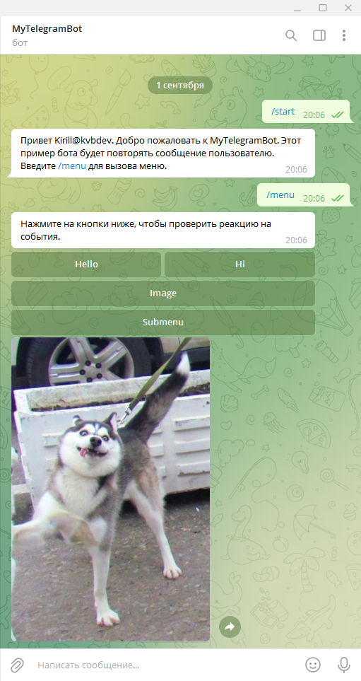

### Telegram Bot Template

#### Описание

Пример реализации телеграм бота на языке Java.

- Повторяет пользователю его сообщение.
- По команде `/start` показывает приветствие.
- По команде `/menu` отображет многокнопочное меню, в котором:
  - Нажатие на кнопкe `Image` отобразит картинку в чате.
  - Нажатие на кнопку `Submenu` отобразит подменю с воможностью возврата.

#### Подготовка

- Необходимо зарегистрировать собственного бота и получить токен.
- Для этого обратитесь к телеграм боту @BotFather и следуйте подсказкам.
- Сохраните токен зарегистрированного вами бота в переменную окружения `TELEGRAM_TOKEN`

#### Запуск

- Выполните команду **maven**: `mvn exec:java`
- Либо начните выполнение с класса `com.cyber.Main`